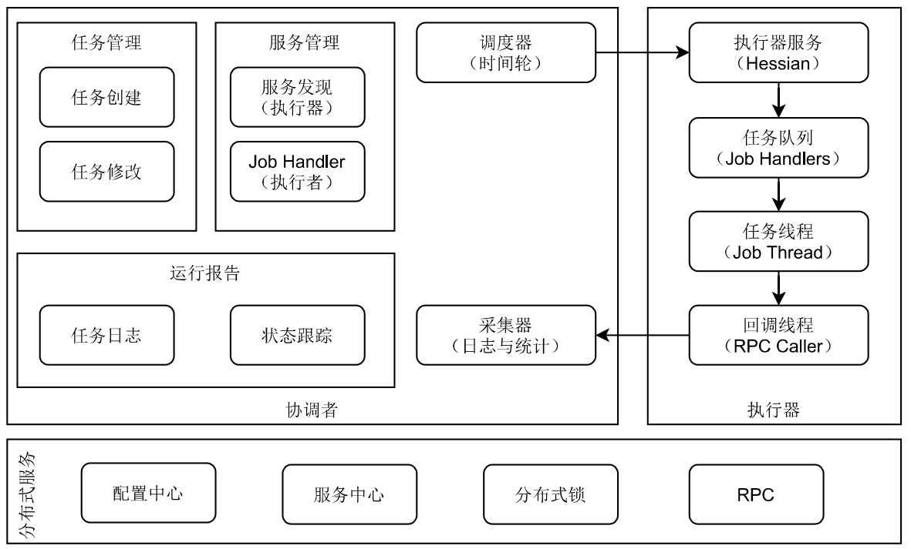

# 分布式任务管理


## 概念
协调者（coordinator）：采用集中式任务调度设计，主要完成任务配置管理、调度（运行/停止），运行状态跟踪等。
执行者（executors）：分布式任务执行者，主要完成任务的具体执行和结果反馈。




## 协调者
- 服务发现:

协调者通过服务中心获取所有提供任务处理者（JobHandler)，以ServiceName.HandlerName作为主键，保存ServiceList。

- 触发策略：

提供丰富的任务触发策略，包括：自动触发（Cron、固定间隔触发、固定延时触发）、事件触发（API触发、父子任务触发）；

- 过期策略：

协调者错过调度时间的补偿处理策略，包括：忽略、立即补偿；

- 调度策略：

特定、轮询、随机、一致性HASH、最少调度、内存优先、CPU优先、响应性能优先和分片

- 分片策略：

一个任务可以让不同执行者执行时，可以选择分片策略：包括 All - 所有执行者都执行，One - 只有一个执行者执行，动态分片 - 条件过滤执行者执行；


## 执行者

- 服务注册：

执行者主动向服务中心注册服务，在MataData中以JobHandler.{Name}作为主键，Description作为内容。表达自己可以提供的任务处理者清单。

- 阻塞策略：

调度过于密集执行器来不及处理时的处理策略，策略包括：单机串行（默认）、丢弃后续调度、覆盖之前调度；

## 异常处理


超时  - 支持自定义任务超时时间，任务运行超时将会主动中断任务；

重试 - 支持自定义任务失败重试次数，当任务失败时将会按照预设的失败重试次数主动进行重试；

告警 - 默认提供邮件方式失败告警，同时预留扩展接口，可方便的扩展短信、钉钉等告警方式；

故障转移 - 任务路由策略选择”故障转移”情况下，如果执行器集群中某一台机器故障，将会自动Failover切换到一台正常的执行器发送调度请求。


# 接口定义

## 执行者

- start(jobId, jobConfig) -> taskId 基于任务开始一个工作，返回工作的唯一编号
- stat(type,paramters) -> info 根据不同类型，查看统计信息，可以是任务日志可执行者的信息
- stop(taskId) -> bool 强制停止一个任务
- 

## 内置任务类型

+ Sharding Job Handler：分片示例任务，任务内部模拟处理分片参数，可参考熟悉分片任务；
+ Http Job Handler：通用HTTP任务Handler；业务方只需要提供HTTP链接即可，不限制语言、平台；
+ Command Job Handler：通用命令行任务Handler；业务方只需要提供命令行即可；如 “pwd”命令；


## 项目中引用方法
1. pom 引用
```xml
 <dependency>
     <groupId>cn.zhumingwu</groupId>
     <artifactId>fast-job</artifactId>
     <version>${fast-job.version}</version>
 </dependency>
```

2.  配置JobConfig.java
```java
@Configuration
public class JobConfig {
    private Logger logger = LoggerFactory.getLogger(JobConfig.class);

    @Value("${project.job.admin.addresses}")
    private String adminAddresses;
    
    @Value("${project.job.executor.appname}")
    private String appName;
    
    @Value("${project.job.executor.ip}")
    private String ip;
    
    @Value("${project.job.executor.port}")
    private int port;
    
    @Value("${project.job.accessToken}")
    private String accessToken;
    
    @Value("${project.job.executor.logpath}")
    private String logPath;
    
    @Value("${project.job.executor.logretentiondays}")
    private int logRetentionDays;
    
    @Bean(initMethod = "start", destroyMethod = "destroy")
    public JobSpringExecutor JobExecutor() {
        logger.info("job config init.");
        JobSpringExecutor JobSpringExecutor = new JobSpringExecutor();
        JobSpringExecutor.setAdminAddresses(adminAddresses);
        JobSpringExecutor.setAppName(appName);
        JobSpringExecutor.setIp(ip);
        JobSpringExecutor.setPort(port);
        JobSpringExecutor.setAccessToken(accessToken);
        JobSpringExecutor.setLogPath(logPath);
        JobSpringExecutor.setLogRetentionDays(logRetentionDays);
    
        return JobSpringExecutor;
    }
}
```

3. 创建执行器管理

```
import com.project.job.core.biz.model.Result;
import com.project.job.core.handler.IJobHandler;
import com.project.job.core.handler.annotation.JobHandler;
import com.project.job.core.log.JobLogger;
import lombok.extern.slf4j.Slf4j;
import org.springframework.stereotype.Component;

import java.util.concurrent.TimeUnit;
 
@Job(value="demoJobHandler")
@Component
@Slf4j
public class CommandJobHandler extends JobHandler {

    @Override
    public Result<String> execute(String param) throws Exception {
        JobLogger.log("-JOB, Hello World.");

        for (int i = 0; i < 5; i++) {
            JobLogger.log("beat at:" + i);
            TimeUnit.SECONDS.sleep(2);
        }

        log.info("hello world!");

        return SUCCESS;
    }

}
```

