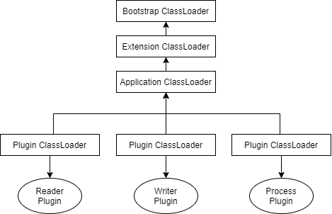

# 插件

## 插件使用

data switch通过插件机制，动态载入reader、writer和process进行数据同步的执行。所有插件需要按约定存放在${HOME}/plugins/目录下。

以mysqlreader为例：

- plugin.json中记录插件的元数据
- mysqlreader.jar即插件主jar
- libs是中放的是依赖的jar

## 插件机制原理

为避免插件中jar多版本冲突，任务执行前就需要脱离当前classLoader去加载这些jar包，执行完成后，又退回到原来classLoader上继续执行接下来的代码。为此，data switch通过自定义类加载器JarLoader，提供Jar隔离的加载机制。

如图，Plugin ClassLoader是Application ClassLoader的子类，主程序通过Thread.currentThread().setContextClassLoader在每次对插件调用前后的进行classLoader的切换实现jar隔离的加载机制

> 前置知识是jvm类加载的双亲委派模型，[参考](https://blog.csdn.net/qq_31957747/article/details/73699730)

在加载某个插件前，需要通过ClassLoaderSwapper，setCurrentThreadClassLoader设置当前新的ClassLoadder，完成插件加载后restoreCurrentThreadClassLoader

PluginClassLoader其实就是一个继承URLClassLoader的类，实现定制化的jar包url的搜索，而具体的类加载的能力由父类URLClassLoader提供。核心在于loadPluginClass()方法。

PluginManager负责扫描加载系统中所有插件

## 总结

1. 首先切换到自定义类加载器PluginClassLoader，保存当前线程的Application ClassLoader并设置新PluginClassLoader。

2. 加载并实例化插件对象。

3. 执行插件对象业务方法。

4. 重新切换为Application ClassLoader，执行后续逻辑。

# 监控

## JMX

JMX即Java管理扩展，可以通过MBean的注册来实现运行时监控，而MXBean是一种可以支持复杂变量类型的MBean

通过JMX，我们可以监控的内容包括：

1、服务器中各种资源的使用情况：如CPU、内存等

2、JVM内存使用情况

3、JVM中的线程情况

4、JVM中加载的类

## Micrometer
Micrometer为最流行的监控系统提供了一个简单的仪表客户端外观，允许仪表化JVM应用，而无需关心是哪个供应商提供的指标。
### Meter

Micrometer提供了与供应商无关的Meter，包括：

- timers（计时器）
- Gauges（量规）
- Counters（计数器）
- DistributionSummaries（分布式摘要）
- LongTaskTimers（长任务定时器）
- FunctionCounter
- FunctionTimer
- TimeGauge。

它具有维度数据模型，当与维度监视系统结合使用时，可以高效地访问特定的命名度量，并能够跨维度深入研究。

